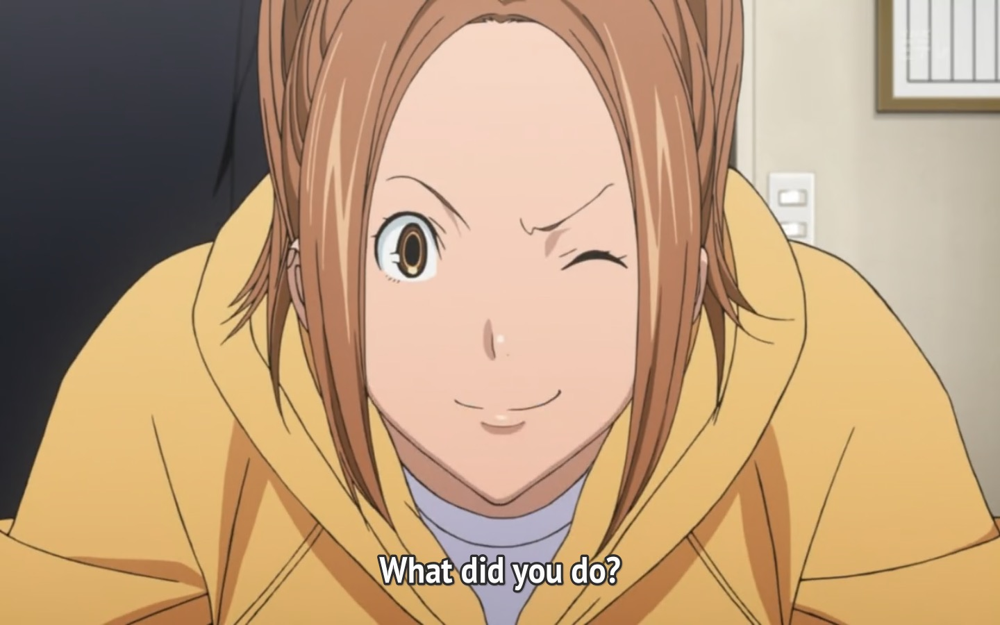
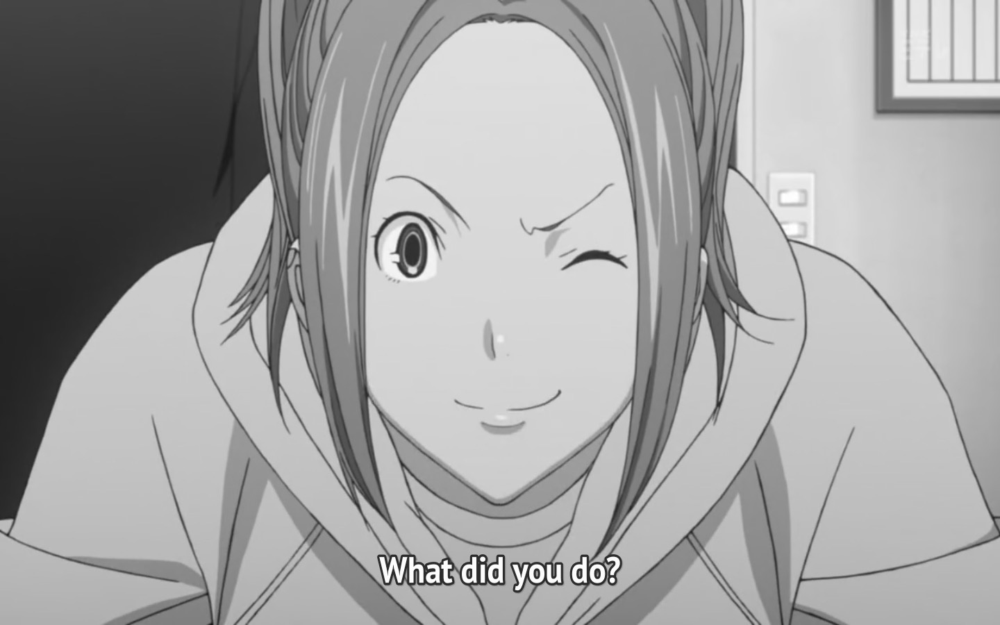
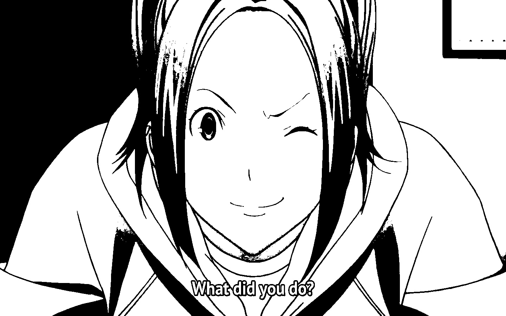

### Original Image

### Grayscale Image

This image will preserve the Shadows but it will evaporate all the colours

### Black and White Image

This image will also remove the shadows and will only convert the respective pixel to our specified shade if it is already above threshold
